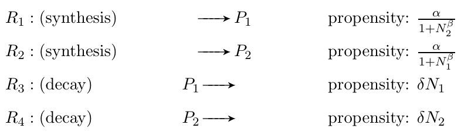

# MMSB2022_HW5
110.2 BEBI5009_生物系統模擬


# Stochastic Simulation Algorithm（Gillespie Algorithm）

Reference：[How to do stochastic simulations in Julia](https://ntumitolab.github.io/mmsb-bebi-5009/intro/04-gillespie.html)

## Task Description

（7.8.26 Noisy toggle switch）

The following reactions represent a bistable toggle switch:


where δ = 1 and β = 4. N1 and N2 stand for the amount of P1 and P2, respectively.

With 3 sets of initial conditions: (p1, p2) = (100, 50), (50, 100), and (75, 75)

1. Please run simulations of the stochastic system for α = 5, 50, 500, and 5000, **both in the direct and first reaction methods** by your own. So there will be _eight_ kinds of simulations in total.
2. Please show that for α = 5000, the system exhibits bistability, and for α = 5, the system is noisy.
3. Please explain the model behaviors when α = 50 and 500.

☆ Note：

- Be sure to run the simulations sufficiently long so that the steady trend is clear (i.e., at least 10,000 reaction steps)
- It may be necessary to run multiple simulations of the same parameter set to confirm your findings.

- bistable 說明：http://www.best.org.tw/upload/downloads_upload/2020_12_BEST%E5%AD%A3%E8%A8%8A-yswu.pdf, p.16, 1.2 基因調控中的雙穩態系統.

## Report
[./MMSB_HW5_SSA_report.pdf](./MMSB_HW5_SSA_report.pdf)


# Agent-based Modeling

Reference：[Simulates viral spread in a population using a SIR model](https://sosiristseng.github.io/juliabook-abm/abm-04.html) 

## Task Description：

Please simulate a combination of 
- beta_max = 0.05, 0.04, 0.03, 0.02, 0.01 (representing personal hygiene: e.g. Wearing a mask) and
- isolated = 0.0, 0.5, 0.7, 0.8, 0.9. (Representing social distancing and/or lockdown measures) 
And thus there will be 25 simulations in total. 

Plot the number of infected individuals over 5000 steps with 5 beta_max parametegrs, each isolated parameter on a different plot.

(That is, plot #1 is isolated = 0.0 with 5 time series: beta_max = 0.05, 0.04, 0.03, 0.02, 0.01, plot #2 is isolated = 0.5 with 5 time series: beta_max = 0.05, 0.04, 0.03, 0.02, 0.01, and so on.)

### SIR Model, isolated = 0.0

```
Q2, maxima (peaks), isolated = 0.0：

- βmax = 0.05  ==> 1000
- βmax = 0.04  ==> 1000
- βmax = 0.03  ==> 1000
- βmax = 0.02  ==> 1000
- βmax = 0.01  ==> 1000
```

### SIR Model, isolated = 0.5

```
Q2, maxima (peaks), isolated = 0.5：

- βmax = 0.05  ==> 983
- βmax = 0.04  ==> 983
- βmax = 0.03  ==> 983
- βmax = 0.02  ==> 983
- βmax = 0.01  ==> 983
```

### SIR Model, isolated = 0.7

```
Q2, maxima (peaks), isolated = 0.7：

- βmax = 0.05  ==> 857
- βmax = 0.04  ==> 878
- βmax = 0.03  ==> 873
- βmax = 0.02  ==> 876
- βmax = 0.01  ==> 882
```

### SIR Model, isolated = 0.8

```
Q2, maxima (peaks), isolated = 0.8：

- βmax = 0.05  ==> 754
- βmax = 0.04  ==> 769
- βmax = 0.03  ==> 757
- βmax = 0.02  ==> 771
- βmax = 0.01  ==> 776
```

### SIR Model, isolated = 0.9

```
Q2, maxima (peaks), isolated = 0.9：

- βmax = 0.05  ==> 376
- βmax = 0.04  ==> 418
- βmax = 0.03  ==> 406
- βmax = 0.02  ==> 398
- βmax = 0.01  ==> 415
```

## Question：

- List the maxima (peaks) of infected individuals in the 25 simulations. Which parameter set is the most effective in "flattening the curve" (having the lowest peak infected individuals)?

        isolated 0.9, βmax = 0.05
        
    ```
    Q2, maxima (peaks), isolated = 0.9：

    - βmax = 0.05  ==> 376
    - βmax = 0.04  ==> 418
    - βmax = 0.03  ==> 406
    - βmax = 0.02  ==> 398
    - βmax = 0.01  ==> 415
    ```

- Compared to decreasing the beta_max parameter, is increasing the "isolated" parameter more effective in flattening the curve?

        YES
